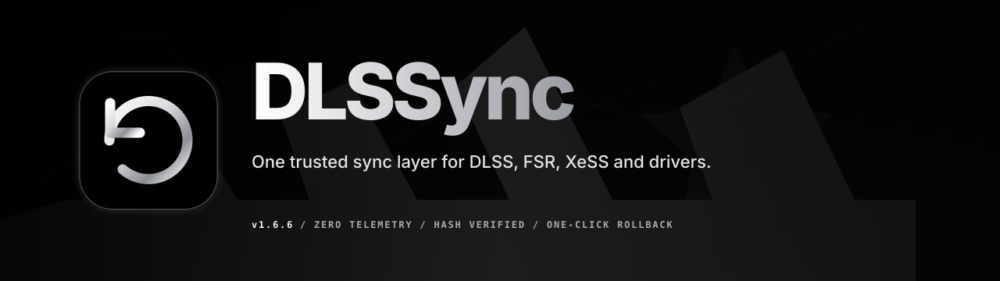
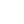

<!-- keep-comment: SEO + LLM/GEO keyword block harvested by GitHub search, Google, and AI crawlers (GPTBot, OAI-SearchBot, ChatGPT-User, PerplexityBot, ClaudeBot, Google-Extended). Invisible to README readers.
  DLSSync is an all-in-one updater for PC gaming graphics libraries AND drivers — not just DLSS.
  Graphics: DLSS updater, DLSS swapper alternative, DLSS Updater, update DLSS DLL, DLSS 4, DLSS Frame Generation, DLSS Ray Reconstruction, NVIDIA Streamline, NVIDIA Reflex, AMD FSR, FSR 3, FSR Frame Generation, Intel XeSS, XeSS Frame Generation, XeLL, Microsoft DirectStorage, upscaling, frame generation, RTX, GeForce, Radeon, Intel Arc.
  Drivers: GPU driver updater, NVIDIA driver update, AMD Adrenalin update, Intel Arc driver update, Windows device driver updater, audio/network/chipset/Bluetooth/storage driver update.
  Standout: lightweight, fast, Rust, Tauri 2, secure by default, SHA-256 hash verified, Authenticode vendor-signed, automatic backups, snapshots, one-click rollback, zero telemetry, no admin, Windows portable, open source, Apache-2.0.
-->

<p align="center">
  <a href="https://github.com/xt0n1-t3ch/DLSSync">
    
  </a>
</p>

<p align="center">
  <b>The all-in-one updater for PC gaming graphics and drivers.</b><br/>
  DLSSync keeps NVIDIA DLSS, AMD FSR, Intel XeSS, Frame Generation, Reflex, Streamline, Ray Reconstruction and Microsoft DirectStorage DLLs in sync with each vendor's latest release — and updates your NVIDIA, AMD and Intel GPU drivers plus other Windows device drivers, too. Lightweight, secure by default, every change reversible. Zero telemetry, open-source.
</p>

<p align="center">
  <b>⭐ If DLSSync keeps your games sharp, a star helps other gamers find it.</b>
</p>

<p align="center">
  <sub><b>New in v1.6.2:</b> DLSSync updates NVIDIA's Streamline plug-ins as one matched, version-locked set — a game's <code>sl.dlss*</code> plug-ins and their <code>sl.interposer</code>/<code>sl.common</code>/<code>sl.pcl</code> runtime move to one official, Authenticode-verified SDK version atomically (every file, or none, since a partial swap crashes the game on launch). Offers are scheme-aware: a driver-managed plug-in is left alone, so your NVIDIA App overrides keep working. DLSSync hosts nothing — binaries come from NVIDIA's own signed SDK. See <a href="CHANGELOG.md#162---2026-05-30">CHANGELOG</a>.</sub>
</p>

<p align="center">
  <a href="https://github.com/xt0n1-t3ch/DLSSync/releases/latest"></a>
  <a href="https://github.com/xt0n1-t3ch/DLSSync/actions/workflows/ci.yml"></a>
  <a href="LICENSE"></a>
  <a href="https://github.com/xt0n1-t3ch/DLSSync/stargazers"></a>
  <a href="https://xt0n1.com"></a>
</p>

<p align="center">
  
  
  
  
  
  
</p>

<p align="center">
  <a href="#what-is-dlssync">What is DLSSync</a>
  &nbsp;·&nbsp;
  <a href="#why">Why DLSSync</a>
  &nbsp;·&nbsp;
  <a href="#features">Features</a>
  &nbsp;·&nbsp;
  <a href="#security">Security</a>
  &nbsp;·&nbsp;
  <a href="#download">Download</a>
  &nbsp;·&nbsp;
  <a href="#faq">FAQ</a>
  &nbsp;·&nbsp;
  <a href="#sponsor">Sponsor</a>
  &nbsp;·&nbsp;
  <a href="#license">License</a>
</p>

---

<h2 id="what-is-dlssync"> &nbsp;What is DLSSync</h2>

**DLSSync is a free, open-source app for Windows that updates everything making your PC games run and look better — from one place.** It keeps your upscaling and frame-generation libraries (NVIDIA DLSS, AMD FSR, Intel XeSS), plus NVIDIA Reflex, Streamline, Ray Reconstruction and Microsoft DirectStorage, in sync with each vendor's latest release — **and it updates your NVIDIA, AMD and Intel GPU drivers and other Windows device drivers too.**

DLSSync detects every game installed via Steam, Epic Games, GOG Galaxy, Ubisoft Connect, EA Desktop, Xbox / Microsoft Store and Battle.net, then keeps the following DLL families synchronized with each vendor's latest publisher release.

<table>
  <thead>
    <tr><th align="left">Vendor</th><th align="left">Family</th><th align="left">DLLs</th></tr>
  </thead>
  <tbody>
    <tr>
      <td rowspan="5">&nbsp;<b>NVIDIA</b></td>
      <td>DLSS Super Resolution</td>
      <td><code>nvngx_dlss.dll</code></td>
    </tr>
    <tr><td>DLSS Frame Generation</td><td><code>nvngx_dlssg.dll</code>, <code>sl.dlss_g.dll</code></td></tr>
    <tr><td>DLSS Ray Reconstruction</td><td><code>nvngx_dlssd.dll</code>, <code>sl.dlss_d.dll</code></td></tr>
    <tr><td>NVIDIA Streamline</td><td><code>sl.interposer.dll</code>, <code>sl.common.dll</code>, <code>sl.pcl.dll</code>, <code>sl.nis.dll</code></td></tr>
    <tr><td>NVIDIA Reflex</td><td><code>sl.reflex.dll</code></td></tr>
    <tr>
      <td rowspan="3">&nbsp;<b>Intel</b></td>
      <td>XeSS Super Resolution</td>
      <td><code>libxess.dll</code>, <code>libxess_dx11.dll</code></td>
    </tr>
    <tr><td>XeSS Frame Generation</td><td><code>libxess_fg.dll</code></td></tr>
    <tr><td>XeLL</td><td><code>libxell.dll</code></td></tr>
    <tr>
      <td rowspan="2">&nbsp;<b>AMD</b></td>
      <td>FidelityFX Super Resolution</td>
      <td><code>amd_fidelityfx_*.dll</code>, <code>ffx_fsr3upscaler_x64.dll</code></td>
    </tr>
    <tr><td>FSR Frame Generation</td><td><code>ffx_frameinterpolation_x64.dll</code></td></tr>
    <tr>
      <td>&nbsp;<b>Microsoft</b></td>
      <td>DirectStorage</td>
      <td><code>dstorage.dll</code>, <code>dstoragecore.dll</code></td>
    </tr>
  </tbody>
</table>

Replacements pass two independent signature checks. A SHA-256 mismatch or an Authenticode publisher mismatch refuses the write. Every replaced DLL goes into a local SQLite snapshot store, so any change reverts in one click.

**Beyond DLLs, DLSSync keeps the whole rig current.** The Drivers tab updates your NVIDIA, AMD and Intel GPU drivers — with per-card version history and signature-verified installs — and other Windows device drivers (audio, network, Bluetooth, chipset, storage and more) through the Windows Update Agent, with an anti-downgrade guard and a System Restore checkpoint before each install. It can also apply reversible NVIDIA DLSS preset and frame-generation overrides through the driver profile.

---

<h2 id="why"> &nbsp;Why DLSSync</h2>

Most tools swap one DLL family. DLSSync keeps your whole graphics stack — and your drivers — current, with signature verification and one-click rollback built in.

<table>
  <thead>
    <tr>
      <th align="left">Capability</th>
      <th align="center">DLSSync</th>
      <th align="center">DLSS&nbsp;Swapper</th>
      <th align="center">DLSS&nbsp;Updater</th>
    </tr>
  </thead>
  <tbody>
    <tr><td>Update DLSS, FSR &amp; XeSS DLLs</td><td align="center">✅</td><td align="center">✅</td><td align="center">✅</td></tr>
    <tr><td>Frame Generation &amp; Ray Reconstruction DLLs</td><td align="center">✅</td><td align="center">✅</td><td align="center">✅</td></tr>
    <tr><td>NVIDIA Streamline set (<code>sl.*</code>) as one atomic, version-locked update</td><td align="center">✅</td><td align="center">❌</td><td align="center">➖</td></tr>
    <tr><td>Update NVIDIA / AMD / Intel <b>GPU drivers</b></td><td align="center">✅</td><td align="center">❌</td><td align="center">❌</td></tr>
    <tr><td>Update other <b>Windows device drivers</b> (audio, network, chipset…)</td><td align="center">✅</td><td align="center">❌</td><td align="center">❌</td></tr>
    <tr><td>SHA-256 <b>+ Authenticode</b> publisher gate before every write</td><td align="center">✅</td><td align="center">➖</td><td align="center">➖</td></tr>
    <tr><td>Automatic backup + one-click rollback</td><td align="center">✅</td><td align="center">✅</td><td align="center">✅</td></tr>
    <tr><td>Single signed native binary — no Python or .NET runtime</td><td align="center">✅ <sub>(Rust)</sub></td><td align="center">❌ <sub>(.NET)</sub></td><td align="center">❌ <sub>(Python)</sub></td></tr>
    <tr><td>Per-user install, no admin required</td><td align="center">✅</td><td align="center">✅</td><td align="center">➖</td></tr>
    <tr><td>Zero telemetry · open-source</td><td align="center">✅</td><td align="center">✅</td><td align="center">✅</td></tr>
  </tbody>
</table>

<sub>✅ yes · ➖ partial / varies · ❌ no. Competitor columns reflect publicly documented features as of May 2026 — corrections welcome via an <a href="https://github.com/xt0n1-t3ch/DLSSync/issues">issue</a>. DLSS Swapper and DLSS Updater are excellent, focused tools; <a href="https://github.com/optiscaler/OptiScaler">OptiScaler</a> solves a different problem (injecting and translating upscalers across GPUs) and pairs well with DLSSync.</sub>

---

<h2 id="features"> &nbsp;Features</h2>

<table>
  <tr>
    <td width="50%" valign="top">
      <h4>Hash-verified DLLs</h4>
      Every DLL is SHA-256 checked against the public CDN-hosted catalog before it lands in your game folder.
    </td>
    <td width="50%" valign="top">
      <h4>Authenticode publisher gate</h4>
      The signer subject is verified against the known NVIDIA, AMD, Intel and Microsoft publisher certificates. The app never re-signs or repackages.
    </td>
  </tr>
  <tr>
    <td valign="top">
      <h4>One-click rollback</h4>
      Every replaced DLL goes into a local SQLite snapshot store. The Backups tab restores any snapshot in a single click.
    </td>
    <td valign="top">
      <h4>Ed25519-signed auto-update</h4>
      The app checks GitHub Releases on a 6 hour cadence. The bottom-left banner downloads, verifies and restarts. Tampered payloads are rejected.
    </td>
  </tr>
  <tr>
    <td valign="top">
      <h4>Under 100 MB idle RAM</h4>
      Close-to-tray plus Windows EcoQoS Efficiency Mode drops idle CPU to about 0 percent. Task Manager shows the green leaf badge.
    </td>
    <td valign="top">
      <h4>Zero telemetry</h4>
      No analytics, no accounts, no phone-home. The only outbound traffic is the GitHub Releases endpoint, the jsDelivr DLL catalog and Steam's public cover-art CDN.
    </td>
  </tr>
  <tr>
    <td valign="top">
      <h4>Per-user install, no admin</h4>
      NSIS installer in <code>currentUser</code> mode. Installs to <code>%LOCALAPPDATA%\DLSSync\</code>. No UAC prompt, no driver, no kernel hook.
    </td>
    <td valign="top">
      <h4>Every Windows launcher</h4>
      Steam, Epic, GOG, Ubisoft, EA, Xbox, Battle.net, plus arbitrary custom folders for portable installs.
    </td>
  </tr>
  <tr>
    <td valign="top">
      <h4>GPU &amp; system driver updates</h4>
      Update NVIDIA, AMD and Intel GPU drivers with per-card version history and signature-verified installs, plus other Windows device drivers via the Windows Update Agent — with an anti-downgrade guard and a System Restore checkpoint.
    </td>
    <td valign="top">
      <h4>DLSS presets &amp; frame-gen overrides</h4>
      Apply reversible DLSS preset and frame-generation overrides through the NVIDIA driver profile (NVAPI) — the same mechanism the NVIDIA App uses, never injection.
    </td>
  </tr>
</table>

---

<h2 id="security"> &nbsp;Security</h2>

The app gates every DLL replacement behind two independent signature checks.

| Layer | Mechanism | Refuses |
|---|---|---|
| Update payload | Ed25519 signature over the NSIS bundle | An update whose signature does not verify against the embedded public key |
| DLL replacement | SHA-256 plus Authenticode publisher subject match against the catalog | A DLL not signed by NVIDIA, AMD, Intel or Microsoft |
| Rollback | Local SQLite snapshot of every replaced file before the write | Nothing. Restore is offline and instant |

The DLL-sync path has no driver, no kernel-mode hook, no in-process injection — it reads and writes DLL files inside the game's own install directory. Two opt-in features reach beyond that path and are documented separately: the GPU driver updater downloads and launches the vendor's own signed installer (which self-elevates through UAC; DLSSync never elevates itself — see [docs/drivers.md](docs/drivers.md)), and the DLSS preset / frame-generation overrides write a reversible NVIDIA driver application profile through NVAPI, the same mechanism the NVIDIA app uses, not injection (see [docs/dlss-overrides.md](docs/dlss-overrides.md)). Every network call is unauthenticated and visible from `Settings > Detection`.

---

<h2 id="download"> &nbsp;Download</h2>

<p align="center">
  <a href="https://github.com/xt0n1-t3ch/DLSSync/releases/latest">
    
  </a>
</p>

Each release ships three formats:

- **`*-setup.exe` (NSIS, recommended)** — per-user install to `%LOCALAPPDATA%\DLSSync\`, no admin prompt, Add/Remove Programs entry, and silent in-app auto-update.
- **`*.msi` (Windows Installer)** — a standard MSI for users and IT who prefer `msiexec` / Group Policy deployment (per-machine; smoke-installed in CI on every release).
- **`*-portable.zip`** — no installer; lowest friction.

**First run — the "unknown publisher" prompt.** DLSSync is not yet code-signed, so Windows SmartScreen may show *"Windows protected your PC"* once per version. This is **not** a virus warning — it appears for any new publisher without an established reputation. Click **More info → Run anyway**. Full, sourced explanation (and the real fixes we keep on file) in [docs/signing-reality.md](docs/signing-reality.md).

CLI alternative:

```pwsh
gh release download --repo xt0n1-t3ch/DLSSync --pattern "*setup.exe"
.\DLSSync_*_x64-setup.exe
```

---

<h2 id="build"> &nbsp;Build from source</h2>

Prerequisites: Rust stable (`rust-toolchain.toml` pins the version), Node 22 LTS, pnpm 9.

```pwsh
git clone https://github.com/xt0n1-t3ch/DLSSync.git
cd DLSSync
pnpm install
pnpm tauri dev
```

Release build:

```pwsh
pnpm tauri build
```

CI validators (run before opening a PR):

```pwsh
pnpm fmt:rust:check
pnpm lint:rust
pnpm --filter dlssync-frontend check
pnpm --filter dlssync-frontend build
cargo check --workspace
```

---

<h2 id="footprint"> &nbsp;Footprint</h2>

| Metric | Target | Measured |
|---|---|---|
| Installer | under 10 MB | 4.5 MB |
| Cold start | under 500 ms | yes |
| Idle RAM | under 100 MB | yes |
| Idle CPU minimized | about 0 percent | yes (EcoQoS active) |

---

<h2 id="roadmap"> &nbsp;Roadmap</h2>

- [x] v1.0: Windows portable, NSIS installer, auto-update banner, tray, EcoQoS Efficiency Mode, all 7 launchers, hash and Authenticode gates, Apache 2.0.
- [x] v1.2: Apply pipeline hardening — shared per-URL download cache, streaming downloads with retry ladder, per-apply cancellation, failure-centric apply modal, tray inflight badge.
- [x] v1.5: GPU driver updater for NVIDIA, AMD and Intel with per-card version history and signature-verified installs; DLSS preset and frame-generation overrides through the NVIDIA driver profile; per-game anti-cheat and anti-tamper detection; broader FSR and XeSS coverage; redesigned Library, Drivers tab and game drawer.
- [ ] Next: SignPath OSS Authenticode signing to remove the SmartScreen warning on first run.
- [ ] Later: per-DLL changelog viewer with a diff against the installed build, and custom catalog sources for community-maintained DLL trees.

---

<h2 id="faq"> &nbsp;FAQ</h2>

<details>
<summary><b>How is this different from DLSS Updater or DLSS Swapper?</b></summary>

<br/>

DLSSync writes the new DLL into the game's own folder. It does not symlink, hook the loader or proxy load. The whole project ships as a single signed binary. No Python runtime, no .NET dependency. The hash and Authenticode gates are mandatory by default and configurable in `Settings > Advanced` for development builds. Apache 2.0 and you can read every line in this repository.

</details>

<details>
<summary><b>Does it work with anti-cheat?</b></summary>

<br/>

The app writes a DLL into the game's own install directory. That is the same operation a manual file swap performs. Anti-cheat systems that detect modified game files (Easy Anti-Cheat, BattlEye, Riot Vanguard, Denuvo Anti-Tamper) treat a swapped DLL — and, in online titles, a forced DLSS driver-profile override — as a tampered file, which can lead to a kick or ban. There are confirmed reports of bans after both.

DLSSync detects anti-cheat per game (a local scan of the install folder for known anti-cheat binaries, plus a community dataset bundled into the manifest, matched by Steam app id or name) and shows a warning before any DLL swap or DLSS override. It never blocks the action — it surfaces the risk so the choice is yours. Check the policy of your specific title before applying.

</details>

<details>
<summary><b>Does the app phone home?</b></summary>

<br/>

The only outbound traffic is:

- `api.github.com` for the release update check, capped at one request every 6 hours.
- `cdn.jsdelivr.net` for the DLL catalog manifest.
- `cdn.cloudflare.steamstatic.com` and `cdn2.steamgriddb.com` for game cover art, only if the art is not already cached locally.
- For the GPU driver updater, only when you open the Drivers tab or install a driver: `gfwsl.geforce.com` and `raw.githubusercontent.com/ZenitH-AT/nvidia-data` (NVIDIA), `dsadata.intel.com` (Intel), and the AMD driver host (AMD).

Every request is unauthenticated. No hardware identifier, install list or other identifying information is sent.

</details>

<details>
<summary><b>Why Windows only?</b></summary>

<br/>

Linux support is coming soon as more testing is needed.

</details>

<details>
<summary><b>How do I roll back if an update breaks a game?</b></summary>

<br/>

Open the Backups tab. Every DLL the app has replaced is listed with the timestamp, original version, SHA-256 and a Restore button. Snapshots live at `%USERPROFILE%\DLSSync\Backups\` as plain files and you can copy them out manually.

</details>

<details>
<summary><b>Can I pin a specific DLL version?</b></summary>

<br/>

Yes. In the game detail drawer, every DLL family has a version picker covering every release tracked in the catalog, including historical and experimental builds. Pinned versions are stored in `settings.json` and survive rescans.

</details>

<details>
<summary><b>Does it touch DRM, Denuvo or anti-cheat binaries?</b></summary>

<br/>

No. The app reads and writes DLL files inside the game directory. It never patches executables, never touches DRM binaries, never alters anti-cheat files.

</details>

---

<h2 id="contributing"> &nbsp;Contributing</h2>

See [`CONTRIBUTING.md`](CONTRIBUTING.md). Branch off `main`, keep commits focused, run the validator chain before opening a PR.

---

<h2 id="author"> &nbsp;Author</h2>

<p>
  <a href="https://github.com/xt0n1-t3ch">
    
    &nbsp;github.com/xt0n1-t3ch
  </a>
  &nbsp;&nbsp;·&nbsp;&nbsp;
  <a href="https://discord.com/users/211189703641268224">
    
    &nbsp;Discord
  </a>
  &nbsp;&nbsp;·&nbsp;&nbsp;
  <a href="https://xt0n1.com">
    
    &nbsp;xt0n1.com
  </a>
</p>

If DLSSync saved you a manual DLL swap, a star on the repository helps other gamers find it.

---

<h2 id="sponsor">Sponsor</h2>

DLSSync is built and maintained on free time. Zero telemetry, no paid tier, no upsell. If the app saves you time or you want it to keep tracking new releases, a sponsorship covers the manifest CI, the auto-update signing, and the hours that keep the catalog fresh.

<p>
  <a href="https://ko-fi.com/xt0n1"></a>
  <a href="https://github.com/sponsors/xt0n1-t3ch"></a>
  <a href="https://www.paypal.me/xt0n1"></a>
</p>

---

<h2 id="license"> &nbsp;License</h2>

Apache 2.0. See [`LICENSE`](LICENSE) and the attribution in [`NOTICE`](NOTICE).

DLSSync is an independent open-source project. It is not endorsed by, sponsored by or affiliated with NVIDIA, Intel, AMD or Microsoft. DLSS, NVIDIA, GeForce, RTX, Reflex and Streamline are trademarks of NVIDIA Corporation. XeSS, Xe and Arc are trademarks of Intel Corporation. FidelityFX, FSR and Radeon are trademarks of Advanced Micro Devices, Inc. DirectStorage, DirectX and Windows are trademarks of Microsoft Corporation. Every redistributed vendor DLL retains its original Authenticode signature.
