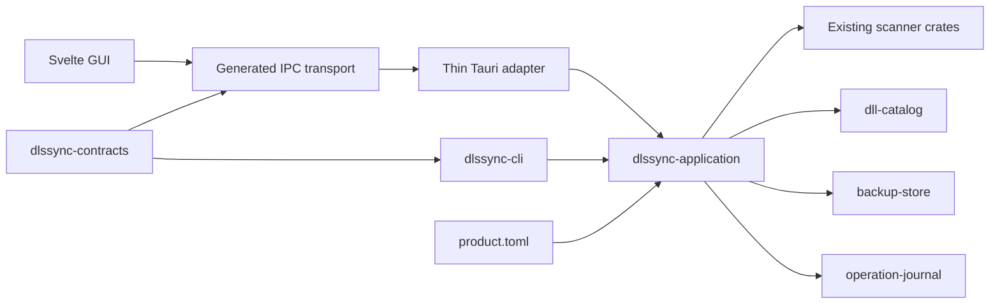

# DLSSync 1.7 architecture

`1.7.0` separates policy and use cases from delivery adapters.

The diagram clarifies that Tauri owns lifecycle, windows, tray, and IPC only; application decisions are shared with the CLI.

## Owners

- `product.toml`: product identity, public URLs, distribution policy, portable marker.
- `Cargo.toml [workspace.package].version`: canonical release version.
- `dlssync-contracts`: cross-process DTOs, error envelopes, plan and journal shapes.
- `dlssync-application`: scan, plan, apply, rollback, policy, and portable-root use cases.
- `operation-journal`: append-only operation persistence and redacted export.
- `xtask`: bindings, architectural checks, version drift, release policies, and competitive-document generation.

`cargo xtask generate-product` projects the public link surface owned by
`product.toml` into `frontend/src/generated/product.ts`. CI rejects stale output
and product URLs hardcoded elsewhere in frontend source.

## Distribution policy

| Capability | Standard | Nexus | Portable |
|---|:---:|:---:|:---:|
| Application self-update | Yes | No | No |
| Automatic catalog refresh | Yes | No | Yes |
| Explicit signed catalog refresh | Yes | Yes | Yes |
| Data root | User profile | User profile | `<exe>\data` |

The Nexus adapter returns the current trusted catalog without network access when an automatic trigger arrives. Only `manual_user` may contact the canonical upstream.
